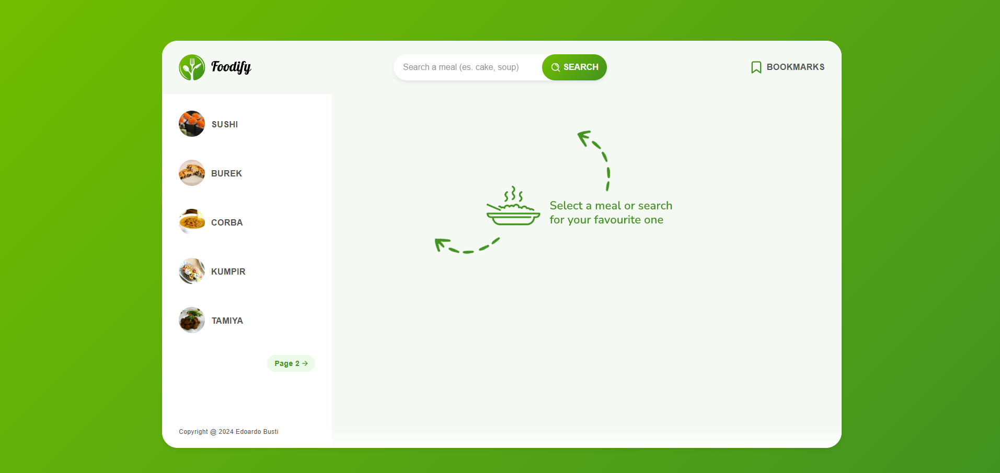
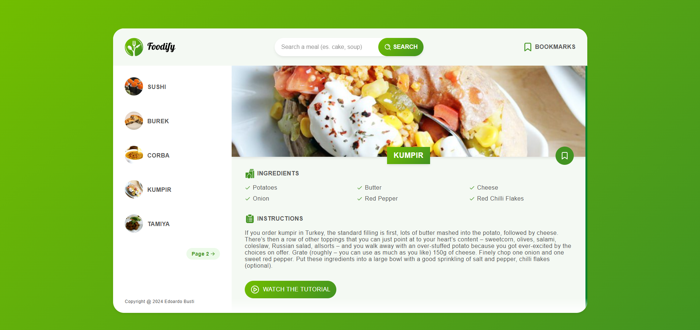
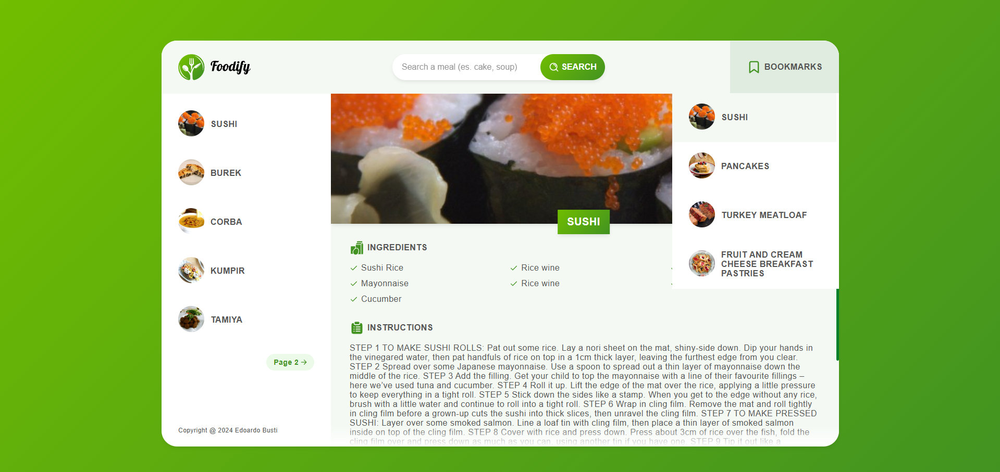

# 🍔 Foodify (React version)

An upgraded version of Foodify, now built with React. It showcases my skills in creating reusable components, using custom hooks, and managing state with prop drilling, marking my first hands-on experience with React development.

**⚠️ Note**: This application is designed for desktop use only and is not mobile responsive.

## 🌟 Features

- **Search for Meals**: Users can search for their favorite recipes.
- **View Ingredients**: Each recipe displays the necessary ingredients.
- **Save Recipes**: Users can save their favorite recipes for easy access later.
- **Step-by-Step Tutorial**: View step-by-step instructions for preparing meals.
- **Asynchronous Data Fetching**: Smooth data retrieval with asynchronous functions for a better user experience.
- **Error Handling**: Robust error handling to manage issues like failed API requests or missing data.

## 🔧 Additional Features

- **Reusable Components**: Built modular, reusable components to ensure scalability and maintainability of the app.
- **Custom Hooks**: Created custom hooks to encapsulate logic and improve code reusability.
- **Prop Drilling**: Implemented prop drilling to pass data through multiple layers of components.
- **Pixel-perfect design**: Every detail is crafted with precision to ensure a flawless user experience.

## 🛠️ Technologies Used

- **React**
- **CSS3**
- **HTML5**

## 🌐 Live Version on Netlify

You can view the live version of the project on **Netlify**:

- **🔗 Live Demo URL**: [https://foodify-react.netlify.app](https://foodify-react.netlify.app)

## 🏁 Getting Started Locally

This app was bootstrapped using [Create React App](https://github.com/facebook/create-react-app).

### 📜 Available Scripts

In the project directory, you can run:

#### `npm start`

Runs the app in development mode. Open [http://localhost:3000](http://localhost:3000) to view it in your browser.

#### `npm test`

Launches the test runner in interactive watch mode.

#### `npm run build`

Builds the app for production to the `build` folder.

#### `npm run eject`

Ejects the app to give you full control over the build configuration (use with caution).

## 📚 Learn More

- [Create React App Documentation](https://facebook.github.io/create-react-app/docs/getting-started)
- [React Documentation](https://reactjs.org/)

## 📸 Screenshots

### 🏠 Landing Page

### 🍽️ Selected Meal

### 📌 Bookmarks View

